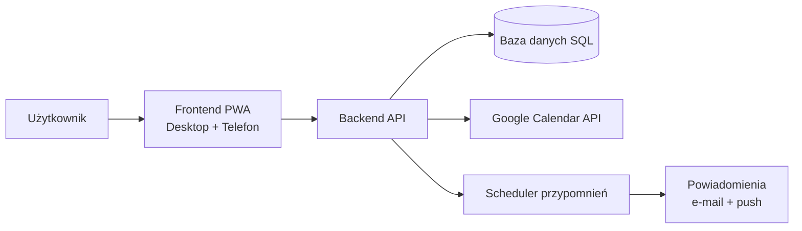
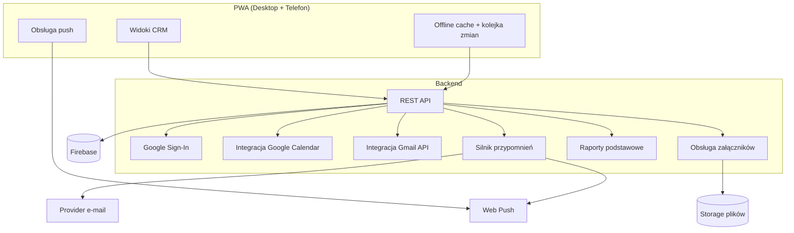

# CRM - ustalenia projektowe

Data startu: 2026-05-08
Status: faza analizy i projektowania (bez kodowania)

## 1) Cel aplikacji

Zbudować prosty i niezawodny CRM dla ok. 300 klientów, z naciskiem na:
- kartotekę klienta (mail, telefon, adres, nazwa firmy, osoba kontaktowa),
- historię kontaktów,
- planowanie kolejnych kontaktów,
- kalendarz i przypomnienia.

## 2) Wstępny zakres MVP

1. Lista klientów + filtrowanie i wyszukiwanie.
2. Karta klienta:
   - nazwa firmy,
   - osoba kontaktowa,
   - e-mail,
   - telefon,
   - adres.
3. Rejestr kontaktów:
   - data kontaktu,
   - forma kontaktu (telefon/mail/spotkanie/inne),
   - notatka.
4. Plan kolejnego kontaktu:
   - data kolejnego kontaktu,
   - opis przypomnienia,
   - status (zaplanowane/zrealizowane/przesunięte).
5. Kalendarz:
   - widok dzienny/tygodniowy/miesięczny,
   - lista zadań "na dziś" i "zaległe".
6. Przypomnienia:
   - e-mail,
   - push na telefon.

## 3) Wstępna architektura (desktop + telefon)

Preferowana architektura:
- Frontend web responsywny (PWA), działający na komputerze i telefonie.
- Backend API (REST) + baza danych SQL.
- Moduł harmonogramu przypomnień (scheduler/cron).

Dlaczego tak:
- jedna baza kodu na komputer i telefon,
- prostsze utrzymanie,
- łatwiejszy start i szybki rozwój.

## 4) Schemat logiczny (po pierwszych decyzjach)

## 5) Model danych (roboczo)

Główne encje:
- Client (klient),
- Interaction (historia kontaktów),
- FollowUp (zaplanowane kolejne kontakty / przypomnienia),
- User (użytkownik systemu).

Minimalne pola encji Client:
- id,
- company_name,
- contact_person_name,
- email,
- phone,
- address,
- created_at,
- updated_at.

Minimalne pola encji Interaction:
- id,
- client_id,
- contact_date,
- channel,
- notes,
- created_by.

Minimalne pola encji FollowUp:
- id,
- client_id,
- due_date,
- reminder_text,
- status,
- completed_at.

## 6) Pytania do doprecyzowania (decyzyjne)

1. Czy w kolejnych etapach planujemy więcej niż jednego użytkownika?
2. Czy w wersji po-MVP dodać import CSV/Excel?
3. Czy załączniki mają limit rozmiaru i typów plików?
4. Jaki zakres offline ma mieć aplikacja po MVP (pełny czy częściowy)?
5. Jakie dokładnie wskaźniki w raportach są najważniejsze biznesowo?
6. Czy backup codzienny ma mieć też retencję (np. 30 dni)?

## 7) Potwierdzone decyzje

- Użytkownicy na start: 1 osoba.
- Role/uprawnienia: brak (1 konto admin).
- Osoba kontaktowa: jedna na klienta (w MVP).
- Przypomnienia: e-mail + push.
- Integracja kalendarza: Google Calendar.
- Hosting aplikacji: mydevil.net.
- Import danych: brak w MVP (ręczne dodawanie).
- Załączniki: tak (PDF/obrazy) w MVP.
- Tryb telefonu: podstawowy offline (odczyt + kolejka zmian).
- Raporty: podstawowe raporty w MVP.
- Kopie zapasowe: codziennie.
- Wysyłka e-mail: zawsze z jednego konta firmowego Gmail.
- Katalog/oferta: jeden plik (np. PDF) jako załącznik.
- Mail podsumowujący ustalenia: wysyłka ręczna przyciskiem z możliwością edycji treści.
- Logowanie: konto Google (Google Sign-In).
- Repozytorium kodu: GitHub.
- Baza danych: Firebase (konto już istnieje).
- Kolejność sprintów: zaakceptowana.
- Kalendarz: zaakceptowany (CRM -> Google Calendar).

## 8) Ustalenia na teraz

- Priorytet: architektura i struktura przed kodowaniem.
- Zakładana skala: ok. 300 klientów.
- Kluczowe moduły: klienci, kontakty, kalendarz, przypomnienia.
- Docelowo: jedna aplikacja PWA na desktop i telefon + backend API + SQL + scheduler.
- Docelowo: jedna aplikacja PWA na desktop i telefon + backend API + Firebase + scheduler.
- Zakres MVP jest prawie zamknięty i gotowy do rozpisania na backlog techniczny.
- Kolejny krok: przygotować finalną specyfikację MVP + podział na etapy implementacji (bez kodu).

## 9) Docelowy schemat komponentów (MVP)

## 10) Finalna specyfikacja MVP (zamrożenie zakresu)

### 10.1 Moduł Klienci
- Lista klientów z wyszukiwaniem po: nazwa firmy, osoba kontaktowa, e-mail, telefon.
- Filtry: "wszyscy", "z zaplanowanym kontaktem", "zaległe kontakty".
- Formularz klienta: nazwa firmy, osoba kontaktowa, e-mail, telefon, adres.
- Walidacje podstawowe: poprawny e-mail, niepuste pole nazwy firmy.
- Przy nazwie klienta widoczny licznik dni od ostatniego kontaktu (np. "12 dni").

### 10.2 Moduł Kontakty (historia)
- Dodanie wpisu kontaktu dla klienta.
- Pola: data kontaktu, kanał, notatka.
- Kanały MVP: telefon, e-mail, spotkanie, inne.
- Historia kontaktów widoczna na karcie klienta (od najnowszych).
- Dodatkowe pola handlowe przy kontakcie:
  - ustalenia cenowe,
  - produkty kupowane przez klienta.

### 10.3 Moduł Follow-up i przypomnienia
- Zaplanowanie kolejnego kontaktu z datą i opisem.
- Statusy: zaplanowane, zrealizowane, przesunięte.
- Automatyczne oznaczanie jako zaległe po przekroczeniu terminu.
- Powiadomienia realizowane przez e-mail i push.
- Możliwość wysłania e-maila podsumowującego ustalenia handlowe bezpośrednio po kontakcie.

### 10.4 Moduł Kalendarz
- Widok dzienny/tygodniowy/miesięczny.
- Prezentacja follow-upów i zaległych spraw.
- Integracja jednostronna z Google Calendar (sync z CRM do Google) w MVP.

### 10.5 Moduł raportów
- Raport 1: liczba kontaktów w okresie (dzień/tydzień/miesiąc).
- Raport 2: liczba zaległych follow-upów.
- Raport 3: liczba zaplanowanych follow-upów na najbliższe 7 dni.

### 10.6 Moduł załączników
- Dodawanie załączników do klienta oraz wpisu kontaktu.
- Typy w MVP: PDF, JPG, PNG.
- Przechowywanie plików w storage obiektowym.
- Możliwość dołączania katalogu/oferty do wiadomości e-mail.

### 10.7 Dostęp i bezpieczeństwo (MVP)
- Logowanie przez konto Google (Google Sign-In).
- Dostęp oparty o jedno konto właściciela na start.
- Backup bazy: codzienny.

### 10.8 Moduł e-mail sprzedażowy (Gmail)
- Integracja z Google Mail (Gmail API) do wysyłania wiadomości z CRM.
- Wysyłka zawsze z jednego konta firmowego Gmail.
- Wysyłka e-mail do klienta z poziomu karty klienta i karty kontaktu.
- Szablony wiadomości:
  - katalog produktowy,
  - podsumowanie ustaleń handlowych (automatyczne wstawianie danych klienta, cen i produktów).
- Wysyłka maila podsumowującego ręcznie (przycisk), z możliwością edycji treści przed wysłaniem.
- Obsługa załączników w e-mailu (np. pliki oferty, katalog).
- Katalog/oferta jako pojedynczy załącznik.

## 11) Architektura techniczna (proponowany stack)

- Frontend: React + TypeScript + PWA.
- Backend: Node.js (NestJS lub Express + TypeScript), REST API.
- Baza danych: Firebase.
- Kolejka zadań/scheduler: cron + worker (przypomnienia, raporty cykliczne).
- Powiadomienia:
  - e-mail przez zewnętrznego providera SMTP/API,
  - push web (Web Push dla PWA).
- Pliki: storage obiektowy (np. S3-kompatybilny).
- Integracje Google:
  - Google Calendar API,
  - Gmail API (wysyłka e-mail + szablony + załączniki).
- Repozytorium: GitHub.
- Hosting aplikacji: mydevil.net.

## 12) Backlog wdrożenia (bez kodowania)

### Sprint 1 - Fundament systemu
Cel: uruchomić szkielet systemu i podstawową kartotekę klientów.
- Projekt bazy danych (Client, Interaction, FollowUp, Attachment, User) w Firebase.
- Logowanie Google Sign-In.
- CRUD klientów.
- Lista klientów + wyszukiwanie.
- Karta klienta (bez kalendarza i przypomnień).
- Kryterium akceptacji: można dodać/edytować/usunąć klienta i wyszukać go na liście.

### Sprint 2 - Kontakty i planowanie follow-up
Cel: pełna obsługa historii kontaktów i planowania kolejnych działań.
- Rejestracja kontaktów (Interaction).
- Pola handlowe kontaktu: ustalenia cenowe i produkty kupowane.
- Planowanie follow-up z terminem i statusem.
- Widok "na dziś" + "zaległe".
- Scheduler sprawdzający terminy.
- Licznik dni od ostatniego kontaktu widoczny przy kliencie.
- Kryterium akceptacji: można zaplanować kontakt, system oznaczy zaległe sprawy i pokazuje licznik dni od kontaktu.

### Sprint 3 - Kalendarz i przypomnienia
Cel: kalendarz operacyjny i automatyczne alerty.
- Widok kalendarza (dzień/tydzień/miesiąc).
- Integracja z Google Calendar.
- Powiadomienia e-mail i push.
- Integracja z Gmail API.
- Wysyłka wiadomości z szablonów (katalog, podsumowanie handlowe) z załącznikami.
- Potwierdzanie realizacji follow-up po przypomnieniu.
- Kryterium akceptacji: użytkownik otrzymuje przypomnienie zgodnie z planem.

### Sprint 4 - Załączniki, raporty, offline
Cel: domknięcie MVP funkcjonalnie.
- Załączniki PDF/JPG/PNG dla klientów i kontaktów.
- Raporty podstawowe.
- Tryb offline podstawowy (odczyt + kolejka zmian do synchronizacji).
- Testy akceptacyjne całego MVP.
- Kryterium akceptacji: aplikacja działa stabilnie na desktopie i telefonie.

## 13) Kryteria gotowości do startu kodowania

- Zakres MVP zatwierdzony bez nowych funkcji "na teraz".
- Zatwierdzony stack technologiczny.
- Zatwierdzona kolejność sprintów.
- Zatwierdzone wymagania niefunkcjonalne (sekcja 14).
- Zatwierdzone środowisko wdrożenia: GitHub + mydevil.net + Firebase.

## 14) Wymagania niefunkcjonalne (MVP)

- Wydajność: obsługa co najmniej 300 klientów bez odczuwalnych opóźnień UI.
- Dostępność: aplikacja responsywna na desktop i telefon.
- Niezawodność: codzienny backup bazy + monitoring błędów aplikacji.
- Bezpieczeństwo: logowanie Google OAuth, kontrola dostępu, HTTPS.
- Utrzymywalność: logi aplikacyjne i prosta procedura wdrożeniowa.

## 15) Następna decyzja od właściciela projektu

Do zatwierdzenia przez Ciebie przed kodowaniem:
1. Potwierdzenie finalne: stack React + TS + Node + Firebase + PWA + Google APIs.
2. Potwierdzenie finalne: wdrożenie przez GitHub na mydevil.net.

## 16) Weryfikacja hostingu mydevil.net (bazy danych)

Sprawdzenie dokumentacji mydevil:
- mydevil udostępnia MySQL (zarządzanie w panelu, SSH, phpMyAdmin),
- mydevil udostępnia PostgreSQL (zarządzanie w panelu, SSH, phpPgAdmin),
- zewnętrzne połączenia do baz są wspierane.

Wniosek projektowy:
- Możemy trzymać bazę lokalnie na mydevil (MySQL/PostgreSQL) albo użyć Firebase.
- Zgodnie z Twoją decyzją wybieramy Firebase jako bazę główną, a mydevil jako hosting aplikacji.

## 17) Start techniczny - checklista uruchomienia projektu

### 17.1 GitHub i repozytorium
- [ ] Utworzyć repozytorium GitHub dla projektu CRM.
- [ ] Ustawić gałęzie: `main` (produkcja) i `develop` (integracja).
- [ ] Dodać podstawowe reguły repo (PR required, ochrona `main`).
- [ ] Dodać sekrety projektu (klucze Firebase i Google API) jako sekrety CI/CD.

### 17.2 Firebase (baza + auth + storage)
- [ ] Utworzyć projekt Firebase dla CRM (lub wskazać istniejący).
- [ ] Włączyć Authentication -> Google Sign-In.
- [ ] Skonfigurować bazę (Firestore lub Realtime DB) zgodnie z modelem danych MVP.
- [ ] Włączyć Firebase Storage na załączniki (katalog/oferta, pliki klienta).
- [ ] Ustawić reguły bezpieczeństwa (dostęp tylko dla autoryzowanego konta).
- [ ] Przygotować codzienny backup danych (harmonogram + retencja).

### 17.3 Google Cloud / API
- [ ] W Google Cloud Console powiązać projekt z Firebase.
- [ ] Włączyć Gmail API i Google Calendar API.
- [ ] Skonfigurować OAuth consent screen.
- [ ] Dodać redirect URI dla środowisk: local/stage/production.
- [ ] Wygenerować OAuth Client ID/Secret dla aplikacji.
- [ ] Dodać konto Gmail firmowe jako konto nadawcy.

### 17.4 mydevil.net (hosting aplikacji)
- [ ] Utworzyć środowisko Node.js dla backendu na mydevil.
- [ ] Utworzyć hosting statyczny/build dla frontendu PWA.
- [ ] Ustawić domenę/subdomenę dla aplikacji CRM.
- [ ] Włączyć HTTPS (certyfikat SSL) dla domeny.
- [ ] Ustawić zmienne środowiskowe produkcyjne (Firebase/Google API).
- [ ] Skonfigurować logi aplikacyjne i restart procesu Node.

### 17.5 CI/CD (GitHub -> mydevil)
- [ ] Przygotować workflow GitHub Actions dla build + test.
- [ ] Przygotować workflow deploy na mydevil po merge do `main`.
- [ ] Dodać krok migracji/aktualizacji reguł Firebase przy deployu.
- [ ] Dodać osobny deploy na środowisko testowe (opcjonalnie).

### 17.6 Konfiguracja produktu (MVP)
- [ ] Wprowadzić listę produktów i sposób zapisu ustaleń cenowych.
- [ ] Przygotować szablon e-maila "katalog produktowy".
- [ ] Przygotować szablon e-maila "podsumowanie ustaleń handlowych".
- [ ] Ustawić ręczny przycisk wysyłki i edycję treści przed wysłaniem.
- [ ] Ustawić licznik dni od ostatniego kontaktu na liście klientów.

### 17.7 Test gotowości przed kodowaniem
- [ ] Login Google działa lokalnie.
- [ ] Połączenie z Firebase działa lokalnie.
- [ ] Gmail API i Calendar API działają na koncie testowym.
- [ ] Deploy próbny na mydevil działa i aplikacja uruchamia się przez HTTPS.
- [ ] Potwierdzony plan sprintów 1-4 jako plan implementacji.

### 17.8 Decyzje operacyjne do zamknięcia teraz
- [x] Repozytorium GitHub: `https://github.com/biuro-ship-it`
- [x] Docelowa domena CRM na mydevil: `www.cmr.pluszek.pl`
- [x] Typ bazy Firebase: `Firestore`
- [x] Backup codzienny: `03:00` (strefa czasowa `Europe/Warsaw`)

## 18) Realizacja Sprint 1 - status implementacji

Status: Zakończone

Zaimplementowane:
- Monorepo `cmr-app` z modułami `frontend` i `backend`.
- Frontend: React + Vite + logowanie Google przez Firebase Auth.
- Backend: Express + weryfikacja tokenu Firebase + API klientów (`GET/POST/PUT/DELETE`).
- Firestore podłączony jako docelowa baza danych.
- Formularz dodawania klienta i lista klientów na frontendzie.
- Pliki konfiguracyjne `.env.example` i instrukcja uruchomienia w `README.md`.
- Wyszukiwarka klientów po nazwie, osobie, e-mailu i telefonie.
- Edycja i usuwanie klientów z poziomu listy.
- Licznik dni od ostatniego kontaktu wyświetlany obok nazwy klienta.

## 19) Realizacja Sprint 2 - status implementacji (część 1)

Status: Zakończone

Zaimplementowane:
- Encja Interaction w backendzie (historia kontaktów per klient).
- Endpointy:
  - `GET /api/clients/:id/interactions`
  - `POST /api/clients/:id/interactions`
- Pola kontaktu: data, kanał, notatka, ustalenia cenowe, produkty.
- Po dodaniu kontaktu backend aktualizuje `lastContactAt` u klienta.
- Frontend: formularz dodawania kontaktu dla klienta + podgląd historii kontaktów.

## 20) Realizacja Sprint 2 - status implementacji (część 2)

Status: Zakończone

Zaimplementowane:
- Encja FollowUp w backendzie (planowanie kolejnych kontaktów).
- Endpointy follow-up:
  - `GET /api/clients/:id/followups`
  - `POST /api/clients/:id/followups`
  - `PATCH /api/clients/:id/followups/:followUpId/status`
  - `GET /api/clients/followups/summary` (lista "na dziś" i "zaległe")
- Frontend:
  - formularz dodawania follow-up dla klienta,
  - lista follow-upów klienta,
  - zmiana statusu follow-up (zaplanowane/zrealizowane),
  - globalny panel "Na dziś i zaległe",
  - filtry klientów: "Wszyscy / Na dziś / Zaległe".

## 21) Realizacja Sprint 3 - status implementacji

Status: Zakończone

Zaimplementowane:
- Backend: API kalendarza (`/api/calendar/events`, `sync`).
- Backend: Integracja z Google Calendar API (CRUD).
- Backend: Scheduler przypomnień uruchamiany co 30 min.
- Frontend: Komponent `CalendarView` (widok wydarzeń z Google).
- Backend: Integracja z Gmail API do wysyłki e-maili.
- Frontend: Formularz wysyłki e-mail z opcjonalnym załącznikiem PDF.

## 22) Realizacja Sprint 4 - status implementacji

Status: Zakończone (MVP funkcjonalne)

Zaimplementowane:
- Backend: Integracja z Firebase Storage (moduł załączników).
- Backend: Endpointy do przesyłania, listowania i usuwania plików.
- Frontend: Komponent `AttachmentList` (upload plików w karcie klienta).
- Backend: Moduł raportów aktywności (`/api/reports/summary`).
- Frontend: Komponent `ReportDashboard` z podsumowaniem statystyk.
- Frontend: Konfiguracja PWA (manifest, service worker, caching API offline).
- Backend: Dodano testy jednostkowe (`vitest`) dla usług Google Calendar.
